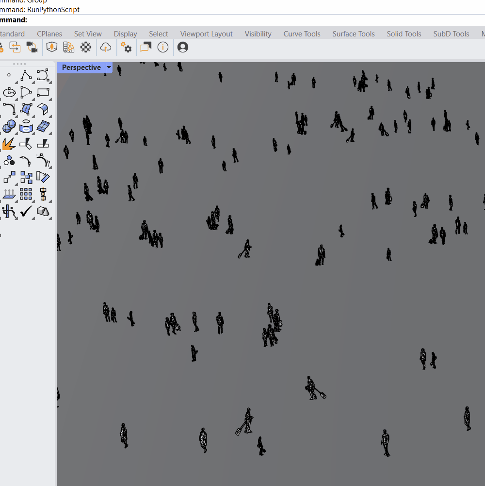
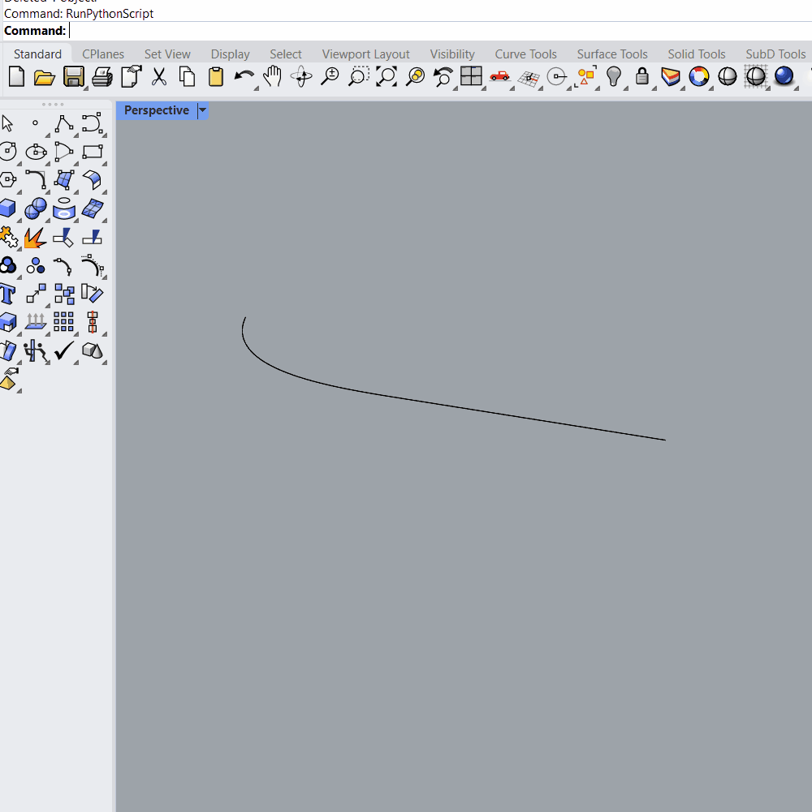
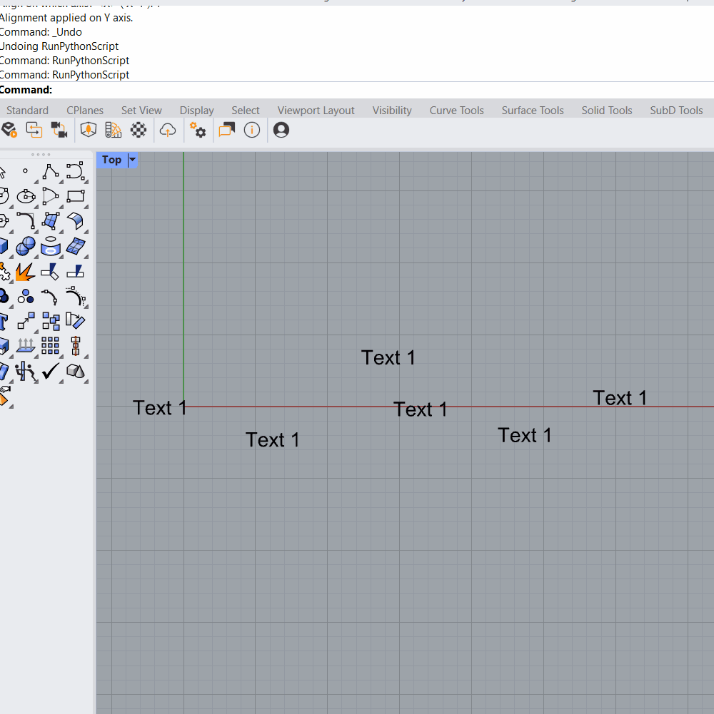

# Rhino Python

This folder contains Python tools for Rhino and Grasshopper.

## Scripts

Scripts are stored in the `scripts/` subfolder:

- **simplegfa.py** — Calculates the total area of bottom faces of selected BREPs and reports the result in square meters.  
  [▶ Demo](#simplegfa-demo)

- **randomreduce.py** — Deletes a random percentage (20/40/60/80) of selected objects.  
  [▶ Demo](#randomreduce-demo)

- **bottomcurvepiping.py** — Generates curves around the bottom-face perimeter of selected BREPs, groups them, and opens curve piping settings for Enscape.  
  [▶ Demo](#bottomcurvepiping-demo)

- **roadrampsimple.py** — Creates a simple uniformly sloped road surface from a left-hand base curve, with preview options, and can also generate a vertical-offset solid volume for boolean operations.  
  [▶ Demo](#roadrampsimple-demo)

- **scatterblocks.py** — Scatters a block instance or geometry across a surface or mesh with options for density, random rotation, scaling, and alignment to surface/mesh normals.  
  [▶ Demo](#scatterblocks-demo)

- **aligntextobjects.py** — Aligns selected Rhino text objects to a chosen reference text object along either the X or Y axis.  
  [▶ Demo](#aligntextobjects-demo)

---

## Demos

### simplegfa demo
*(demo gif coming soon)*

### randomreduce demo

### bottomcurvepiping demo
*(demo gif coming soon)*

### roadrampsimple demo

### scatterblocks demo

### aligntextobjects demo
